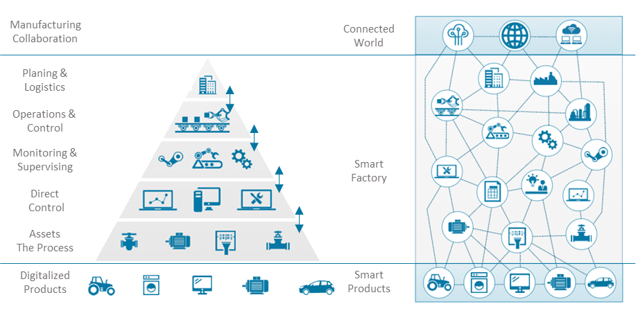
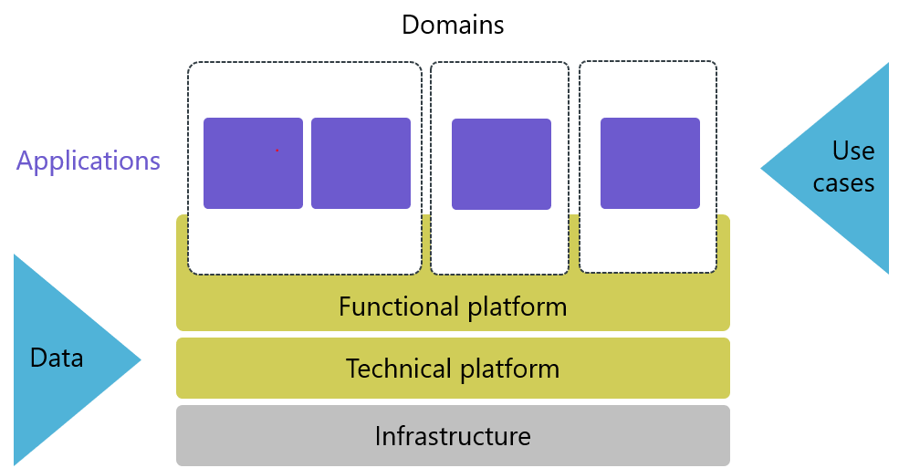
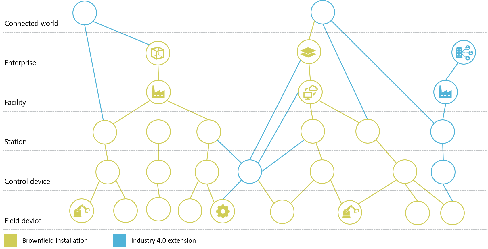

[< Introduction](./01_Introduction.md)

# Approach

The goal of the OMP MRA working group is to provide an open, based on
industry standards, higher-level manufacturing reference architecture,
enabling companies to align their shop floor infrastructure and systems
while allowing industrial solutions to integrate faster. A
technologically agnostic view is presented, which focuses on
functionality over vendor specifications.

Key concepts the MRA will address are:

-   Interoperability, flexibility & agility  
    (capacity flexibility with adaptive production building blocks)

-   Innovation capabilities (state-of-the-art technologies, new business
    models)

-   Integration capabilities (brownfield and greenfield) along with
    cybersecurity requirements

-   Scalability for different industry environments

Practical guidance, blueprints, and architectural sketches are provided
to help companies with their digital transformation.

## Vision and Mission

When it comes to architecture design and approaches the complexity
between IT and OT is already very high. The integration and connection
efforts between shopfloor systems, machines, controls, sensors, other
assets, and several existing IoT Platforms from different vendors are in
a continuous improvement process. Very often these projects get stuck in
singled-out proofs-of-concept because the holistic overall approach is
missing.

Manufacturing processes require complex interactions of multiple,
separate systems on different levels. In the past, these systems have
often been systematically assembled into the well-known ISA-95
automation pyramid. This pyramid has its origins in the hierarchical
enterprise structure of the Purdue Enterprise Reference Architecture
(PERA) and current norms like IEC 62264 are still based upon it.

As described by the *Platform Industry 4.0 / RAMI 4.0 Model* *(see
Figure 1)* the manufacturing ecosystem is moving from hardware-based
structure and hierarchy-based communication to a more flexible system of
machines and actors which can interact across hierarchy levels and
communicate among all participants.

<figure class="image">
    
    <figcaption><b>Figure 1: Overcome the Purdue ISA-95 model to build a smart 
    manufacturing platform. - RAMI 4.0 inherited and evolved the 
    standard IEC:62264 hierarchy  (Plattform Industrie 4.0, 2016a, pp. 11-12);
    </b> 
    © Plattform Industrie 4.0; Anna Salari, designed by freepik</figcaption>
</figure>
 
 

New capabilities like discoverability, self-descriptiveness, and
responsibility negotiation of assets up to data sharing across company
boundaries, might help to overcome the rigid pyramid model and will
create a more flexible network-driven architecture design.

The mission of the MRA working group is to provide hands-on guidance on
how to define a reference architecture in this heterogeneous
environment. This architecture serves the needs of concrete smart
manufacturing use cases while taking new capabilities and new business
models into account.

By designing such a smart manufacturing architecture there should be
considered some main areas of concern:

-   ***Data Governance:*** It is not just about connecting and
    collecting data, it extends into the transformation, collection,
    contextualization, and finally exposing it as actionable
    information. Building this contextualization and transformation from
    the beginning is important to enable the surfacing of primary
    constructs such as virtualized industrial assets and topologies.
    Further enablement of analytics and machine learning is supported
    through the publication of the context through a form of catalog and
    registry to support data scientists and process engineers to
    implement valuable solutions.

-   ***Cybersecurity***: By enabling shopfloor inbound and outbound
    communication, and enabling customers and partners access to
    production data, a secure, reliable communication flow should be
    established. Therefore, smart manufacturing solutions need a solid
    design of connectivity and communication protocols as well as
    sophisticated identity and access management systems.

-   ***Industrialization and Productization*** The starting point of
    digital transformation might be data integration and reporting use
    cases, however, over time the need arises to create a pattern-based
    service catalog to enable reuse within the transformation. This
    might be a side-by-side activity by creating a smart manufacturing
    center of excellence.

-   ***Enterprise Deployment:*** Implementing a digital platform
    utilized by optimization-orientated use cases will go through a life
    cycle or maturity process. It starts with experimenting, goes to
    incubate to prove its value in one site followed by deployment to
    multiple sites. Therefore, the platform needs to support enterprise
    deployment and management concepts and deployment techniques, at
    times differing between those utilized by IT and OT operations teams
    as it extends into edge environments. The techniques may differ from
    location to location based on software and hardware selection at
    each location.

## Scope and System Structure 

The collection of data, the transformation of data into information, and
the various possibilities to make data and/or information actionable,
and by this valuable, are the heartbeat of smart manufacturing. This is
relevant in single plants and cross companies’ boundaries covering whole
value chains or to enable data sharing concepts.

Therefore, **use cases** based on **data flows** are the drivers
defining the scope of the MRA.

<figure class="image">
    
    <figcaption><b>Figure 2: Data Flows and Use Cases are the main driver of the Manufacturing Reference Architecture</b></figcaption>
</figure>
 
 

As data and information are driving smart manufacturing, a consistent
definition of semantics is one of the primary challenges. These
semantics are being addressed in the OMP Semantic Data Structuring (SDS)
Working Group and are then aligned with the overall architecture.

**Use Cases** are scenarios of system behavior and express a business
need. They are defined broadly in this context (e.g., predictive
maintenance, production control tower) and consume information and data
independently from each other.

Domain-specific **applications** are running on a platform, like
maintenance apps for the shop floor or warehouse managing apps for the
logistics department.

Due to the system complexity and to enable an “economy of scale” a
**platform approach** is chosen. The platform can be divided into a
functional and a technical part *(see Figure 2).*

The **functional platform** is business domain-dependent and contains
services for the applications built on top of it. Examples are asset
tracking, part traceability, or order data provisioning which are
consumed by different applications for specific purposes. In contrast,
the **technical platform** is independent of the business domain and the
basic enabler for the functional platform. Examples are device
management, virtual tenancy, logging, certificate management, IAM, etc.

Technical enablers like Integrated Developer Environments (IDE) or BI
solutions can be part of both platform layers depending on the domain
knowledge they incorporate: A dashboard solution can be rather abstract
or already preconfigured with aspects like OEE measuring.

While sometimes the borders are blurry there is a rule of thumb to
separate the functional and technical platform from one another:
Business partners typically would only invest in the development of the
functional platform. While the functional platform generates the direct
business value together with the applications on top of it, the
technical platform is the mandatory enabler and foundation for it.
Examples of the “blurriness” are hierarchy service and virtual tenancy
for the different plants and entities in the plants. They are spanning
both platforms and therefore must be implemented in both layers.

Both platforms run on a defined **infrastructure**, that provides the
actual compute power to execute any function, such as edge devices,
servers, or other computers.

A central design principle for the smart factory will be the capability
to scale agile and flexible production processes both vertically and
horizontally.

In
most manufacturing companies highly heterogeneous brownfield environments
are in place, all using variations of the ISA-95 model, but with
different technical implementations of comparable capabilities. This is
very often because of historical processes and/or due to a broad variety
of products manufactured.

The OMP MRA assumes exactly this heterogenous “brownfield” environment
and targets a holistic IIoT platform, providing digital capabilities to
enable manufacturers to connect or transfer their existing hierarchies
to the requirements of Industry 4.0. As shown in *figure 3* the strict
hierarchical structure can be extended with new elements: As introduced
in RAMI the “connected world” is extending the architecture to a system
outside the enterprise. They can be integrated down to lower levels. An
example is a SaaS condition monitoring solution to monitor a given
machine. As shown system connections can span multiple layers.

<figure class="image">
    
    <figcaption><b>Figure 3: Scope of Manufacturing Reference Architecture</b></figcaption>
</figure>
 
 

The MRA proposes to add to existing architectures, connecting to, and
potentially cutting across, boundaries and layers of the existing
infrastructure.

With all its limitations the automation pyramid at the same time
answered a lot of questions. During the transformation indicated in
*figure 3*, many strategic decisions must be made. Here are some
examples:

-   **Deployment:**  
    Where is the preferred installation and how should existing
    infrastructure be used?

-   **Standardization:**  
    How much entropy should be granted on feature implementation for the
    plants? What is a realistic hardware standardization level?

-   **Application integration:**  
    How can existing and new applications being integrated across the
    whole enterprise production system?

-   **Asset Collaboration:**  
    How can existing assets and control systems interact with each
    other? How much collaboration should be targeted? Which discovery
    and negotiation procedures should be implemented? What amount of
    cross-plant collaboration is needed or granted?

-   **Product lifecycle scope:**  
    What parts of the product lifecycle should be covered? Is R&D part
    of the scope? How many parts of the supply chain should be included?

-   **Topology:**  
    What quality characteristics (performance, latency, security etc.)
    are needed?

[Manufacturing Characteristics >](./03_Manufacturing_Characteristics.md)