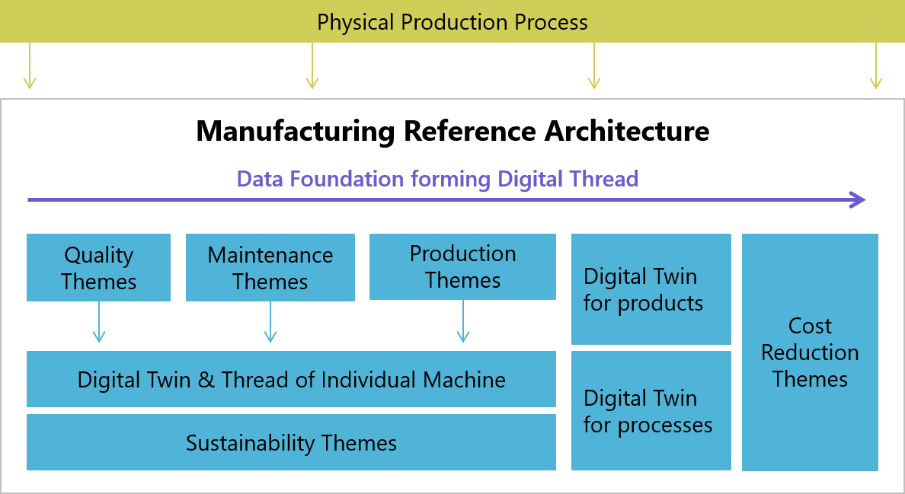

[< Key Challenges](./04_Key_Challenges.md)

# Use Case Considerations for Architecture design

In the continuing work of MRA several representative use cases will be
used to validate the design principles of the reference architecture, in
conjunction with the Semantic Data Structuring (SDS) WG and the IoT
Connectivity Working Group (IoT).

An architecture should not stand alone but must be designed in the
context of delivering value to the manufacturing operations. This
chapter introduces the core aspects of the use case themes considered
during the design phase.

The reference architecture should enable manufacturers to leverage the
newest digital and software technologies to e.g., improve KPIs within
the production environment. Whilst manufacturers are broadly aligned in
their desire to improve OEE and reduce costs, individual manufacturers
have different priorities. Levels of automation on the shop floor,
levels of analytical maturity, and end goals for digitalization programs
also differ. Individual manufacturers will have a variety of priorities
covering sustainability.

As such, the reference architecture must serve a variety of use case
themes. The reference architecture should be relevant both as a feasible
starting point and as a cost-effective end goal as manufacturers build
towards their digitalization goals through a series of diverse but
connected projects.

The definition of a company-specific reference architecture is an
iterative process. Use cases drive the process of detailing the
architecture. It is important that the data assets are continuously
refined and unnecessary data duplication across use cases is avoided.

<figure class="image">
    
    <figcaption><b>Figure 4: Example Use Case Themes supported by the Manufacturing
    Reference Architecture</b></figcaption>
</figure>
 
 

The reference architecture must support the concept of a foundation of
data, from which use cases can be built out. ’Starter’ or ‘Entry Point’
use cases typically only require a small, defined set of data to
implement, and can be aligned to three primary domains *(see figure 4)*:

-   ***Quality***: Use cases will range from automated/digital quality
    inspection to root cause analytics.

-   ***Maintenance***: Use cases are focusing on reducing both planned
    and unplanned downtime.

-   ***Production***: This domain covers a broad range of use cases
    around increasing throughput either via better efficiency, or
    reducing stoppages and slowdowns not associated with machine
    availability. This will cover improved process automation &
    materials handling, and increased digitization of the workforce
    through augmented reality and digital workflows.

As data from these domains is gathered and integrated from the factory
floor, they start to form what is called “digital shadows”. From here
more complex use cases, requiring a broader set of data, can be
implemented with only a marginal cost.

***Sustainability***: In addition to reporting requirements these use
cases will allow manufacturers to be more proactive around managing
their carbon footprint, water & waste management, energy management,
etc. while balancing environmental needs against cost, product quality,
and production speed.  
  
***Virtualization:*** As the digital shadow grows for a particular
machine to a complete set of sensor data coupled with its performance
metrics it will form a digital twin of this machine. This digital twin
will support use cases on current activities, in the production and
quality domains.

Further collection and integration of data will form digital threads.
Digital threads support use cases that look to implement use cases that
consider a complete lifecycle – that of an asset, a production process,
or of a product.

1.  ***Product Virtualization***: Capturing the exact circumstances of
    manufacture, including individual raw materials and sub-assemblies
    used in individual product creation. This can also be considered as
    supporting a ‘Lot Size of One’.

2.  ***Production Virtualization***: Enabling the optimization of the
    entire process, vs. individual machines or production steps.

3.  ***Digital Thread***: Whilst virtualization considers the current
    actions of a machine, process, or product; the digital thread will
    consider the behavior over a lifecycle. It is highly suited to
    supporting use cases in the maintenance domain.

4.  ***Topology***: Whilst the virtualized elements on their own have a
    great degree of value the understanding of their relationships to
    each other becomes critical in many scenarios. The knowledge of this
    topology allows for more advanced analytics and use cases.

Use cases around ***cost reduction*** will also be supported by the
reference architecture. These could be top-down use cases, requiring a
broad set of data such as supply chain configuration, work in progress,
and safety stock optimization. Equally, they could be bottom-up use
cases such as cost savings for specific operational steps or supporting
functions.

Regardless of the intent of a specific use case, four **main personas**
need to be considered. While all of them have a large set of
commonalities, some of them require very specific platform capabilities,
which could end in a large set of non-functional requirements for a
platform.

The personas are:

-   ***Operator***: Operators are acting close to the actual production
    process. Tools (incl. the hardware) need to be designed to be used
    in challenging environments and display conditions and predictions
    near real-time. Latency requirements need to be considered – some
    use cases will require sub-second response times. Also, availability
    requirements are quite high.

-   ***Supervisor:*** Foremen or supervisors are acting close to the
    production, focusing on a larger production area than an operator.
    They are frequently considered the process experts and as such their
    input in rating any output from AI and ML is highly valued. They
    will primarily use the same toolset as an operator, but with a
    richer reporting & analytics capability enabling them to take
    actions to improve OEE measures within their shift.

-   ***Plant Management:*** Factory control tower use cases are mostly
    driven by reporting capabilities. However, this persona is aiming
    for yield optimization, which leads to capabilities on a high
    maturity level. Examples are factory maintenance shutdown planning,
    production flow optimization, etc.

-   ***Process or Industrial Engineers:*** In general, the same as on
    plant management level. Solution examples are cross-site production
    optimization, end-to-end simulations, etc. Their personas will be
    supported by Data Scientists in their more complex analytical work.
    The core challenge is to establish a solid enterprise-wide data
    schema, to be able to analyze data across all sites.

As analytic maturity increases, customers, and suppliers (external or
intercompany) can be considered as extended users. Required capabilities
range from integrating demand and supply signals which would influence
production sequencing through to simple status reporting.

[Platform Capabilities >](./06_Platform_Capabilities.md)